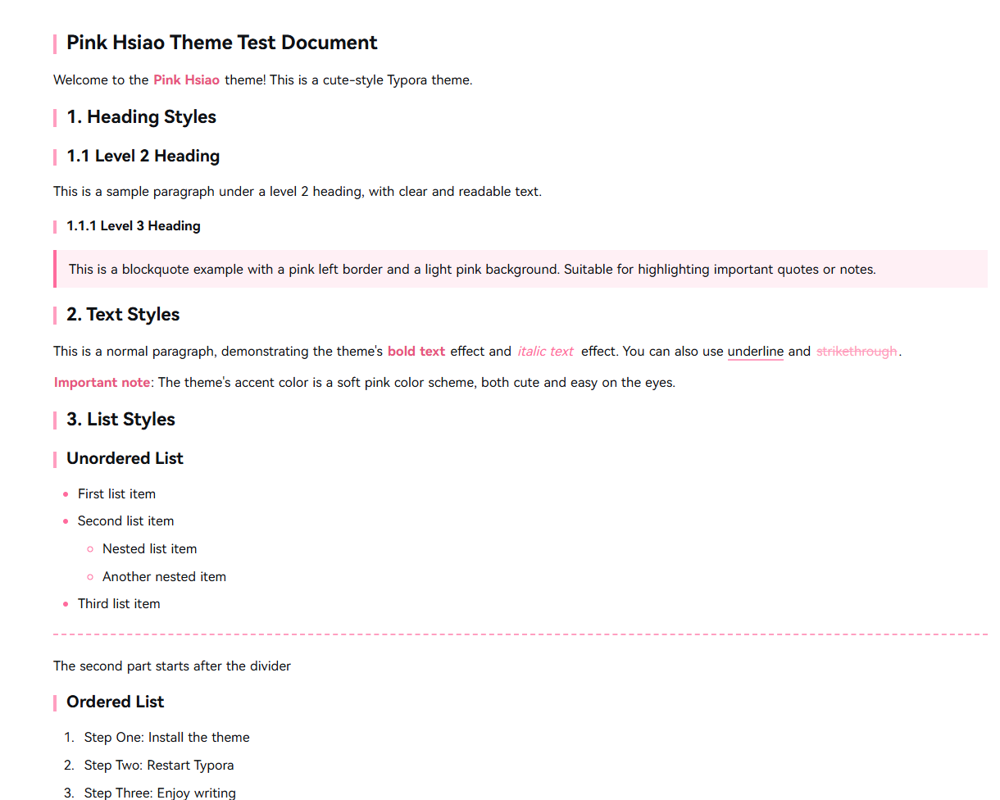

# Pink Hsiao · Cute & Minimal Typora Theme

[中文版](README.md) | **English Version**

A pink-themed Typora theme designed for an elegant writing experience—cute but not noisy, minimal yet rich in details.

## Preview

## Features
- **Cute**: Soft pink color scheme with just the right amount of accents
- **Minimal**: Clean overall design, avoiding large pink areas and flashy decorations to keep focus on content, while referencing DeepSeek's clear typography for better readability
- **Comfortable Fonts**: Uses HarmonyOS Sans for text and Maple Mono for code, providing a smooth reading experience

## Design Philosophy
Pink Hsiao was designed to explore the balance between "cuteness" and "practicality." We believe a great writing theme should provide a pleasant visual experience without ever distracting from content focus.

The theme employs a restrained pink accent strategy, using color only in key areas like title decorations and interactive elements, ensuring large content areas remain clean. The typography design references modern web reading experiences, emphasizing line height, spacing, and contrast optimization for comfortable long writing sessions.

## Installation

1. Download this project
2. Copy both `pink-hsiao.css` and the `pink-hsiao` folder into your Typora themes folder
3. Restart Typora and select Pink Hsiao from the theme menu

---

**Hope you enjoy this theme!** 🎀
