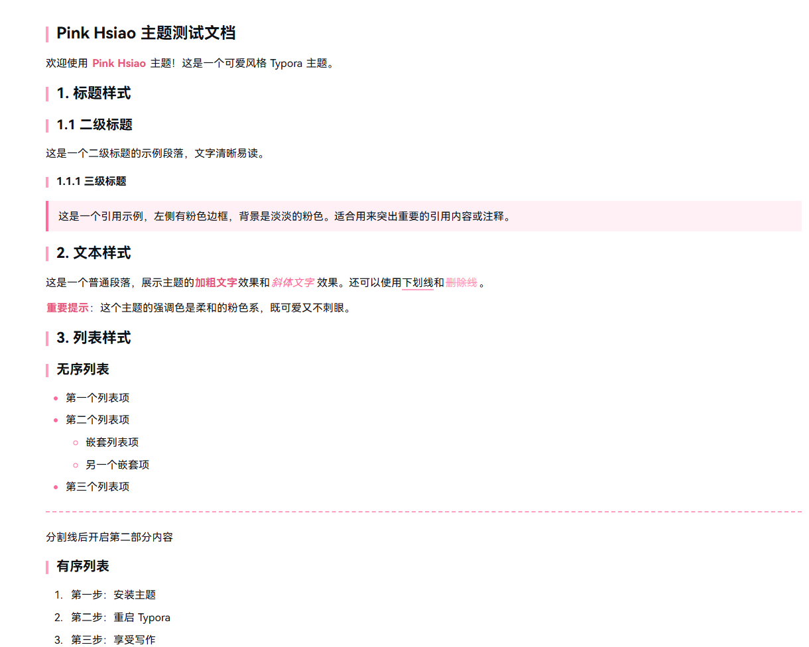

# Pink Hsiao · 可爱简约的 Typora 主题

**中文版** | [English Version](README-en.md)

一款为追求优雅写作体验设计的粉色系主题，可爱但不喧闹，简约但细节丰富。

## 📸 预览

## 特色
- **可爱**：柔和的粉色系配色，点缀恰到好处
- **简约**：整体干净，不使用大片粉色和花哨装饰，让注意力集中在内容上，同时为提升可读性参考了网页版 DeepSeek 的清晰排版
- **字体舒适**：整体使用鸿蒙OS字体，代码部分使用Maple Mono字体，阅读体验流畅自然

## 设计理念
Pink Hsiao 的设计初衷是探索"可爱"与"实用"的平衡点。我们相信，一个优秀的写作主题应该在提供愉悦视觉体验的同时，绝不干扰内容的专注表达。

主题采用克制的粉色点缀策略，只在标题装饰、交互元素等关键位置使用色彩，确保大面积内容区域保持清爽。排版设计参考了现代网页的阅读体验，注重行高、间距和对比度的优化，让长时间写作也能保持舒适。

## 安装

1. 下载这个项目 
2. 将`pink-hsiao.css`和`pink-hsiao`文件夹放入 Typora 主题文件夹
3. 重启 Typora，在主题菜单中选择 Pink Hsiao

---

**希望你喜欢这个主题！** 🎀
